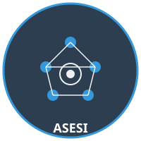

# 🤖 Agente Colaborador USJ / CGE

<p align="center">
  
  &nbsp;&nbsp;&nbsp;
  
  &nbsp;&nbsp;&nbsp;
  
</p>

<p align="center">
  <strong>Universidade São José (Macau)</strong> · <strong>Controladoria Geral do Estado</strong> · <strong>ASESI</strong>
</p>

<p align="center">
  <em>"Robô Nordestino Chinês" — Agente de IA para apoio institucional</em>
</p>

---

## 📋 Sobre o Projeto

Agente de Inteligência Artificial conversacional desenvolvido em parceria entre a **USJ (Universidade São José de Macau)**, a **CGE (Controladoria Geral do Estado)** e a **ASESI (Assessoria Especial de Sistemas de Informação)**.

O agente utiliza **RAG (Retrieval-Augmented Generation)** com LangChain e ChromaDB para responder perguntas com base em documentação interna, auxiliar na redação de documentos e orientar sobre procedimentos institucionais.

## ✨ Funcionalidades

- 💬 **Chat Conversacional** — Memória de conversa com histórico
- 🔍 **Busca Inteligente (RAG)** — Consulta base de conhecimento vetorial
- 📄 **Resumo de Documentos** — Sumarização automática
- ✍️ **Auxílio na Redação** — Rascunhos de ofícios e documentos oficiais
- 📚 **Base de Conhecimento** — Portarias, resoluções, manuais e atas
- 🌐 **Interface Web** — Streamlit para interação visual

## 🏗️ Arquitetura

```
agente-usj-cge/
├── src/
│   ├── agent.py          # Agente conversacional principal
│   ├── rag_engine.py     # Motor RAG com LangChain
│   ├── knowledge_base.py # Gerenciamento da base vetorial
│   ├── collector.py      # Coleta de documentos
│   ├── app_streamlit.py  # Interface web
│   └── config.py         # Configurações centrais
├── data/
│   ├── documents/        # Documentos fonte (PDF, MD)
│   └── chromadb/         # Base vetorial persistida
├── assets/               # Logos e recursos visuais
├── requirements.txt
└── .env.example
```

## 🚀 Instalação

```bash
# Clonar repositório
git clone https://github.com/naubergois/agente-usj-cge.git
cd agente-usj-cge

# Criar ambiente virtual
python -m venv .venv
source .venv/bin/activate

# Instalar dependências
pip install -r requirements.txt

# Configurar variáveis de ambiente
cp .env.example .env
# Editar .env com suas chaves de API
```

## ⚙️ Configuração

Copie o `.env.example` para `.env` e preencha:

| Variável | Descrição |
|----------|-----------|
| `OPENAI_API_KEY` | Chave da API OpenAI |
| `OPENAI_MODEL` | Modelo LLM (padrão: gpt-4o-mini) |
| `CHROMA_COLLECTION` | Nome da coleção ChromaDB |
| `STREAMLIT_PORT` | Porta da interface web |

## 🖥️ Uso

```bash
# Iniciar interface web
streamlit run src/app_streamlit.py --server.port 8501
```

## 🎯 Escopo do Agente

### ✅ O que o agente FAZ:
- Responde perguntas sobre documentação interna
- Busca informações em portarias, resoluções e manuais
- Auxilia na redação de documentos oficiais
- Fornece resumos de reuniões e decisões
- Orienta sobre procedimentos e fluxos internos

### ❌ O que o agente NÃO FAZ:
- Não toma decisões administrativas
- Não acessa sistemas externos sem autorização
- Não divulga informações sigilosas
- Não substitui a análise humana em decisões críticas

## 🛠️ Tecnologias

| Tecnologia | Uso |
|------------|-----|
| Python 3.11+ | Linguagem principal |
| LangChain | Framework de agentes LLM |
| ChromaDB | Base de dados vetorial |
| OpenAI GPT-4o-mini | Modelo de linguagem |
| Streamlit | Interface web |
| Pydantic | Validação de configurações |

## 👥 Instituições Parceiras

| Instituição | Papel |
|-------------|-------|
| **USJ** — Universidade São José (Macau) | Pesquisa e desenvolvimento acadêmico |
| **CGE** — Controladoria Geral do Estado | Governança e controle institucional |
| **ASESI** — Assessoria Especial de Sistemas de Informação | Infraestrutura e sistemas |

## 📄 Licença

MIT License — Veja [LICENSE](LICENSE) para detalhes.

---

<p align="center">
  Desenvolvido com 🧠 por <strong>USJ / CGE / ASESI</strong> — Macau
</p>
