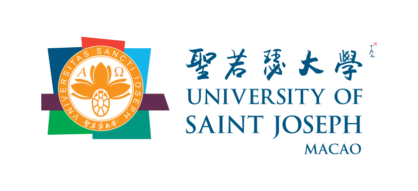

# 🤖 Agente Colaborador USJ/CGE — Robô Nordestino Chinês

<p align="center">
  
</p>

<p align="center">
  
  &nbsp;&nbsp;&nbsp;&nbsp;
  
</p>

<p align="center">
  <strong>Universidade São José (Macau)</strong> · <strong>Controladoria e Ouvidoria Geral do Estado (Ceará)</strong> · <strong>ASESI</strong>
</p>

<p align="center">
  <strong>🇧🇷 Português</strong> · <a href="#-english">🇺🇸 English</a> · <a href="#-中文">🇨🇳 中文</a>
</p>

---

## 🇧🇷 Português

### Sobre o Projeto

Agente de inteligência artificial conversacional desenvolvido para apoio à equipe USJ/ASESI/CGE (Controladoria e Ouvidoria Geral do Estado do Ceará). Utiliza **RAG (Retrieval-Augmented Generation)** para responder perguntas com base na documentação interna, combinando busca semântica em base vetorial com geração de respostas via LLM.

O agente atende servidores da ASESI (Assessoria Especial de Sistemas de Informação), equipe da CGE e equipe da USJ, fornecendo:

- Consultas à documentação interna (portarias, resoluções, manuais)
- Resumo de reuniões e decisões anteriores
- Auxílio na redação de documentos oficiais
- Orientação sobre procedimentos e fluxos internos

### Funcionalidades

| Módulo | Descrição |
|--------|-----------|
| 🧠 **RAG Engine** | Busca semântica + geração de respostas contextualizadas |
| 📚 **ChromaDB** | Base de conhecimento vetorial para busca por similaridade |
| 💬 **Agente Conversacional** | Chat com memória de conversa via LangChain |
| 🌐 **Interface Streamlit** | UI web para interação com o agente |
| 📱 **WhatsApp (wacli)** | Integração com WhatsApp via CLI |
| 🔄 **Hermes Updater** | Atualização automática da base de conhecimento |
| 📋 **Coletor** | Coleta documentos de URLs e arquivos locais |

### Instalação

```bash
# Criar ambiente virtual
python -m venv .venv
source .venv/bin/activate

# Instalar dependências
pip install -r requirements.txt

# Configurar variáveis de ambiente
cp .env.example .env
# Edite .env com sua OPENAI_API_KEY
```

### Uso

#### Interface Web (Streamlit)
```bash
streamlit run src/app_streamlit.py
```

#### Via Python
```python
from src.agent import ConversationalAgent
from src.config import AgentConfig

config = AgentConfig.from_env()
agent = ConversationalAgent(config)

result = agent.chat("O que é a ASESI?")
print(result["response"])
```

#### Indexar Documentos
```bash
python -c "
from src.knowledge_base import KnowledgeBase
kb = KnowledgeBase()
kb.index_all_documents()
"
```

#### Hermes (daemon de atualização)
```bash
python -c "
from src.hermes_updater import HermesUpdater
hermes = HermesUpdater()
hermes.run_daemon()
"
```

### Estrutura do Projeto

```
agente-usj-cge/
├── src/
│   ├── config.py              # Configuração e escopo
│   ├── agent.py               # Agente conversacional
│   ├── rag_engine.py          # Motor RAG
│   ├── knowledge_base.py      # ChromaDB
│   ├── collector.py           # Coletor de documentos
│   ├── whatsapp_integration.py # Bridge wacli
│   ├── hermes_updater.py      # Daemon de atualização
│   └── app_streamlit.py       # Interface web
├── data/
│   ├── documents/             # Documentos da base
│   │   ├── institucional/     # Sobre USJ, ASESI, CGE
│   │   └── procedimentos/     # Manuais e fluxos
│   └── chromadb/              # Base vetorial
├── tests/                     # Testes pytest
├── requirements.txt           # Dependências
└── .env.example               # Template de variáveis
```

### Testes

```bash
pytest tests/ -v
```

### Equipe

- **Nauber Gois** — Coordenador, Arquitetura IA
- **Marcos Henrique** — Desenvolvimento
- **Oton Pinheiro** — Dados

---

## 🇺🇸 English

### About the Project

A conversational AI agent built to support the USJ/ASESI/CGE team (Office of the Comptroller General of the State of Ceará, Brazil). It uses **RAG (Retrieval-Augmented Generation)** to answer questions based on internal documentation, combining semantic search over a vector database with LLM-powered response generation.

The agent serves members of ASESI (Special Advisory for Information Systems), CGE (Office of the Comptroller General), and USJ, providing:

- Queries against internal documentation (decrees, resolutions, manuals)
- Meeting summaries and past decisions
- Assistance drafting official documents
- Guidance on internal procedures and workflows

### Features

| Module | Description |
|--------|-------------|
| 🧠 **RAG Engine** | Semantic search + context-aware answer generation |
| 📚 **ChromaDB** | Vector knowledge base for similarity search |
| 💬 **Conversational Agent** | Chat with conversation memory via LangChain |
| 🌐 **Streamlit Interface** | Web UI for interacting with the agent |
| 📱 **WhatsApp (wacli)** | WhatsApp integration via CLI |
| 🔄 **Hermes Updater** | Automatic knowledge base refresh |
| 📋 **Collector** | Document collection from URLs and local files |

### Installation

```bash
# Create virtual environment
python -m venv .venv
source .venv/bin/activate

# Install dependencies
pip install -r requirements.txt

# Configure environment variables
cp .env.example .env
# Edit .env with your OPENAI_API_KEY
```

### Usage

#### Web Interface (Streamlit)
```bash
streamlit run src/app_streamlit.py
```

#### Python API
```python
from src.agent import ConversationalAgent
from src.config import AgentConfig

config = AgentConfig.from_env()
agent = ConversationalAgent(config)

result = agent.chat("What is ASESI?")
print(result["response"])
```

#### Index Documents
```bash
python -c "
from src.knowledge_base import KnowledgeBase
kb = KnowledgeBase()
kb.index_all_documents()
"
```

### Project Structure

```
agente-usj-cge/
├── src/
│   ├── config.py              # Configuration & scope
│   ├── agent.py               # Conversational agent
│   ├── rag_engine.py          # RAG engine
│   ├── knowledge_base.py      # ChromaDB integration
│   ├── collector.py           # Document collector
│   ├── whatsapp_integration.py # WhatsApp bridge (wacli)
│   ├── hermes_updater.py      # Auto-update daemon
│   └── app_streamlit.py       # Web interface
├── data/
│   ├── documents/             # Knowledge base documents
│   └── chromadb/              # Vector store
├── tests/                     # Pytest test suite
├── requirements.txt           # Dependencies
└── .env.example               # Environment template
```

### Tech Stack

- **LLM**: OpenAI GPT-4o-mini (configurable)
- **Orchestration**: LangChain
- **Vector DB**: ChromaDB
- **Web UI**: Streamlit
- **Messaging**: WhatsApp via wacli CLI
- **Language**: Python 3.11+

### Tests

```bash
pytest tests/ -v
```

---

## 🇨🇳 中文

### 项目简介

这是一个为巴西塞阿拉州审计总局（CGE）旗下 USJ/ASESI/CGE 团队打造的对话式人工智能助手。项目采用 **RAG（检索增强生成）** 技术，通过语义检索内部文档向量数据库并结合大语言模型生成回答，实现对内部知识的智能问答。

该助手服务于 ASESI（信息系统特别顾问处）、CGE（审计总局）及 USJ 团队成员，提供以下能力：

- 查询内部文件（公告、决议、手册）
- 会议总结与历史决策回顾
- 协助起草官方文件
- 内部流程与规程指导

### 功能模块

| 模块 | 说明 |
|------|------|
| 🧠 **RAG 引擎** | 语义搜索 + 上下文感知的答案生成 |
| 📚 **ChromaDB** | 向量知识库，支持相似度检索 |
| 💬 **对话代理** | 基于 LangChain 的带记忆对话 |
| 🌐 **Streamlit 界面** | Web 交互界面 |
| 📱 **WhatsApp (wacli)** | 通过 CLI 集成 WhatsApp 消息 |
| 🔄 **Hermes 更新器** | 知识库自动更新守护进程 |
| 📋 **文档采集器** | 从 URL 和本地文件采集文档 |

### 安装

```bash
# 创建虚拟环境
python -m venv .venv
source .venv/bin/activate

# 安装依赖
pip install -r requirements.txt

# 配置环境变量
cp .env.example .env
# 编辑 .env 文件，填入 OPENAI_API_KEY
```

### 使用方法

#### Web 界面（Streamlit）
```bash
streamlit run src/app_streamlit.py
```

#### Python 接口
```python
from src.agent import ConversationalAgent
from src.config import AgentConfig

config = AgentConfig.from_env()
agent = ConversationalAgent(config)

result = agent.chat("什么是 ASESI？")
print(result["response"])
```

#### 索引文档
```bash
python -c "
from src.knowledge_base import KnowledgeBase
kb = KnowledgeBase()
kb.index_all_documents()
"
```

### 项目结构

```
agente-usj-cge/
├── src/
│   ├── config.py              # 配置与作用域
│   ├── agent.py               # 对话代理
│   ├── rag_engine.py          # RAG 引擎
│   ├── knowledge_base.py      # ChromaDB 集成
│   ├── collector.py           # 文档采集器
│   ├── whatsapp_integration.py # WhatsApp 桥接
│   ├── hermes_updater.py      # 自动更新守护进程
│   └── app_streamlit.py       # Web 界面
├── data/
│   ├── documents/             # 知识库文档
│   └── chromadb/              # 向量数据库
├── tests/                     # 测试用例
├── requirements.txt           # 项目依赖
└── .env.example               # 环境变量模板
```

### 技术栈

- **大语言模型**: OpenAI GPT-4o-mini（可配置）
- **编排框架**: LangChain
- **向量数据库**: ChromaDB
- **Web 界面**: Streamlit
- **即时通讯**: WhatsApp（通过 wacli CLI）
- **编程语言**: Python 3.11+

### 测试

```bash
pytest tests/ -v
```

### 团队

- **Nauber Gois** — 协调员、AI 架构师
- **Marcos Henrique** — 开发工程师
- **Oton Pinheiro** — 数据工程师

---

## 📄 Licença / License / 许可证

Projeto interno USJ/ASESI/CGE.  
Internal project USJ/ASESI/CGE.  
USJ/ASESI/CGE 内部项目。
